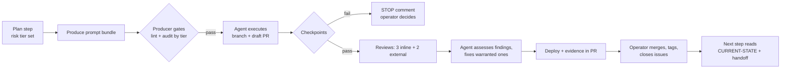

# 2. The operating model

**Work is divided into phases; a phase into numbered steps; a step is exactly one pull request, and the pull request is the only place where a step is considered done.** Five roles run the loop, usually on different vendors' models, and a risk tier set at planning time decides how heavy the review is.

## 2.1 Phases, steps, pull requests

- A **phase** has one theme — a feature, a refactor, or a stabilisation effort — and 6–12 steps. Mixing themes in a phase is the reliable way to get scope creep and confused agents.
- A **step** is one PR with a bounded scope, its own prompt bundle (Chapter 4), a risk tier, and a version tag when it changes shipped behaviour. Research steps produce a document and no version bump.
- A **PR** is done when it contains the code *and* every deliverable of the step: state-file update, changelog entry, session log, consolidated audit, and any edits the next step's prompt needs. Post-merge work is limited to tagging and closing issues.

> **Why in-PR.** The source project's first attempt put documentation "after merge". Within one phase the state file was a step behind, prompts referenced stale board addresses, and the operator opened "documentation update" PRs the day after merges. The rule that fixed it: *if you find yourself opening a docs PR the day after a merge, that is the drift the in-PR rule prevents.*

## 2.2 Five roles

| Role | What it does | Typical assignment | Rule |
| --- | --- | --- | --- |
| **Architect / planner** | Phase plans, architecture decisions, calendar, risk tiers | Highest-capability model, with the human | Reads live code before every answer; runs the assumption audit (Chapter 3) before any plan |
| **Prompt producer** | Turns a plan step into the three-file prompt bundle | Same model class, separate session | Subject to the gates in Chapter 5; produces prompts, never code |
| **Coding agent** | Executes one prompt on a branch, opens the PR, runs build/test/deploy, posts evidence | Mid-tier model with repo and shell access | Executes literally; stops on any failed checkpoint; never edits generated files |
| **Reviewers** | Inline and whole-PR review with severity classification | 3 inline on the PR platform + 2 external, different families | Assess-then-fix loop is run by the coding agent, not the reviewers |
| **Operator** | Everything an agent cannot: physical tests, judgement on findings, merge, state file | The human | The only role allowed to override a checkpoint failure |

Keep the roles on separate sessions even when the same model could do two of them. A planning session that also writes prompts drifts toward what is convenient to write; a producer that also reviews its own prompts approves them.

## 2.3 The loop for one step

Three properties matter more than the boxes. The gates before dispatch are mechanical where possible (Chapter 5). A failed checkpoint stops the agent; it never "fixes" the code to make the check pass. And the state the next step reads was written inside this step's PR, so nothing is reconstructed from memory.

## 2.4 Risk tiers

Set at planning time, per step, and written into the prompt header.

| Tier | Examples | Reviewers | Producer audit before dispatch | Prompt style (Chapter 4) |
| --- | --- | --- | --- | --- |
| **Low** | Struct/type definitions, docs, tests, cosmetic | Project default | Lint only | Intent and acceptance criteria |
| **Medium** | New endpoint, new task, dashboard behaviour | Project default | Lint + one independent auditor | Intent and acceptance; prescribe only interface contracts |
| **High** | Boot path, persistence/migration, auth, anything irreversible on a device or in data | Project default | Lint + two auditors from different families, reconciled | Full prescription allowed; embedded code compiled before dispatch |

The tier changes the producer-side audit and the prompt style, not the reviewer count. Set the reviewer count once per project and keep it: the source project runs five reviewers (three inline, two external) on every code step, because on several occasions exactly one of the five found a defect the others missed; the optimisation target there is automating the orchestration, not trimming reviewers. A project that chooses three as its default keeps three at every tier.

The tier is the only lever that keeps *producer-side* verification cost proportional. The source project learned this by not having it: with every step treated as high, verification effort reached roughly ten times production effort and the project stopped for four months (Chapter 7, pitfall 6).

## 2.5 Source-of-truth hierarchy

When two sources disagree — and they will — resolve in this order:

1. Live code on the main branch
2. Build output, test results, telemetry, measurements from the running system
3. `CURRENT-STATE.md`
4. The decision log
5. The current phase plan
6. The current step's prompt and handoff
7. Changelog and the latest phase closure
8. Archived postmortems and old handoffs
9. Anyone's memory, including the model's

Archived documents are evidence, not instructions. Any plan older than the last refactoring phase is stale until re-verified. A chat transcript in which "we decided X" is level 9 until X is in the repository.

> **From the source project.** In September 2026 three sources disagreed about whether the project's critical crash bug was fixed: the state file and the merged code said yes; the agent instructions, the lessons file, and the decision log said "deferred". A planning calendar was then written on the assumption it was still open. The hierarchy above settles it in ten seconds — level 1 wins — and the fix is a documentation PR, not a firmware phase.

## 2.6 Truth-seeking as a named discipline

Four rules, applied in every planning, debugging, and review session:

1. **Confirm what before hypothesising why.** One diagnostic command before any explanation.
2. **Eliminate the simplest explanation first.** An elegant theory is the signal to run the basic check.
3. **State assumptions and verify each.** "I assume X because Y" — then a command that tests X. If it cannot be tested this session, label it `UNVERIFIED ASSUMPTION` in the output.
4. **When evidence and narrative diverge, evidence wins** — including when the narrative is your own.

Evidence strength, strongest first: direct measurement → source inspection → current documentation → historical documentation → human memory → model inference. Anything that affects production needs the first two.
