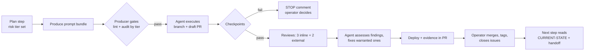

# 2. The operating model

**This is quite simple - a Phase contains numbered Steps, each Step contains one PR (pull request). The pull request is the only place where a step is considered done.** 

Then roles are assigned to AI agents - usually models from different vendors. And a risk tier, set at planning time, decides how much checking a step's prompt gets before it goes to the coding agent.

## 2.1 Phases, steps, pull requests

- A **phase** has one theme - a feature, a refactor, or a stabilization effort (read - complex bug fixing) - and contains 6–12 steps, depending on phase complexity. Remember - mixing themes in a phase is the reliable way to get scope creep and confused agents and more time wasted as a result.
- A **step** is one PR with a bounded scope, its own prompt bundle (see [Chapter 4](04-writing-prompts.md)), a risk tier, and a version tag when it changes shipped behavior. Note - research steps produce a document and way forward and no version bump.
- A **PR** is considered done when it contains the code *and* *every* deliverable of the step: state-file update, changelog entry, session log, consolidated audit, and any edits the next step's prompt needs. Post-merge work should be limited to tagging and closing issues.

> **Why all in-PR.** Here is a lesson from the source project with the attempt to put documentation "after merge". Result was that within one phase the state file was a step behind, prompts referenced stale IP addresses, and the operator opened "documentation update" PRs the day after merges. The rule that fixed it: *if you find yourself opening a docs PR the day after a merge, that is the drift the in-PR rule above prevents.*

## 2.2 Five roles (AI and human) defined in the lifecycle of the project

| Role | What it does | Typical assignment | Rule |
| --- | --- | --- | --- |
| **Architect / planner** | Phase plans, architecture decisions, calendar, risk tiers | Highest-capability AI/LLM model, with the Operator as co-Architect, reviewer and approver | Reads live code before every answer; runs the assumption audit (see [Section 2.7](#27-before-any-plan-the-assumption-audit)) before any plan |
| **Prompt producer** | Turns a plan step into the three-file prompt bundle | Same model class, separate session | Subject to the gates in [Chapter 5](05-keeping-the-producer-honest.md); produces prompts, never code |
| **Coding agent** | Executes one prompt on a branch, opens the PR, runs build/test/deploy, posts evidence/documentation | Mid-tier model with repo and shell/tool access | Executes literally; stops on any failed checkpoint/gate; never edits generated files |
| **Reviewers** | Inline and whole-PR review with severity classification, typically done by mid- to high-tier AI agents | 3 inline on the PR platform + 2 external, different model families | Assess-then-fix loop is run by the coding agent, not the reviewers |
| **Operator** | in addition to be co-Architect - everything an agent cannot: physical tests, judgment on findings, merge, state file | The human (You) | The only role allowed to override a checkpoint failure |

Keep every role in its own session, even when the same model could do two of them. Why? A planning session that also writes prompts drifts toward what is easy to write, and a producer that reviews its own prompts approves them.

## 2.3 The loop for one step

The flowchart below is visual representation of the process. It is simplified - not showing what happens when the prompt producer fails the gates.

Three properties matter: 
- the gates before the prompt is handed to the agent are mechanical where possible (see [Chapter 5](05-keeping-the-producer-honest.md))
- a failed checkpoint stops the agent; it never "fixes" the code to make the check pass
- and the state the next step reads was written inside this step's PR, so nothing is reconstructed from memory.

## 2.4 Risk tiers

Set at planning time, per step and written into the prompt header. Risk tiers below are from the source ESP32 project.

>  __Note__: the examples per risk tier are specific to project, so in your project they might be completely different. You need to assess risks and revise the table as needed.

| Tier | Examples | Reviewers | Producer audit before dispatch | Prompt style ([Chapter 4](04-writing-prompts.md)) |
| --- | --- | --- | --- | --- |
| **Low** | Struct/type definitions, docs, tests, cosmetic | Project default | Lint only | Intent and acceptance criteria |
| **Medium** | New endpoint, new task, dashboard behavior | Project default | Lint + one independent auditor | Intent and acceptance; prescribe only interface contracts |
| **High** | Boot path, persistence/migration, auth, anything irreversible on a device or in data | Project default | Lint + two auditors from different families, reconciled | Full prescription allowed; embedded code compiled before dispatch |

One thing to keep in mind - the reviewer count for a tier does not change. Set the reviewer count once per project and keep it: the project runs five reviewers (three inline, two external) on every code step, because on several occasions exactly one of the five found a defect the others missed (as mentioned in the [previous chapter](01-before-you-start.md)); the optimization target there is automating the orchestration, not trimming reviewers. 

The tier is the only lever that keeps *producer-side* verification cost proportional. The source project learned this by not having it: with every step treated as high, verification effort reached roughly ten times production effort and wasted time.

## 2.5 Source-of-truth hierarchy

Source of truth was mentioned number of times and one should not underestimate importance of it. When two sources disagree - and they will - resolve dispute in this order and make following list as a discipline:

1. Live code on the main branch - this trumps everything
2. Build output, test results, telemetry, measurements from the running system
3. `CURRENT-STATE.md`
4. The decision log
5. The current phase plan
6. The current step's prompt and handoff
7. Changelog and the latest phase closure
8. Archived postmortems and old handoffs
9. Anyone's memory, including the model's - this is the _least_ priority.

Archived documents are evidence, not instructions. Any plan older than the last refactoring phase is stale until re-verified. A chat transcript in which "we decided X" is level 9 from the list above, until X is in the repository.

> **From the source project.** Three sources disagreed about whether the project's critical crash bug was fixed: the state file and the merged code said yes; the agent instructions, the lessons file, and the decision log said "deferred". A planning calendar was then written on the assumption it was still open. The hierarchy above settles it in ten seconds - level 1 wins. And the fix for disagreement is to fix the documentation as a PR, not a firmware phase PR.

## 2.6 Truth-seeking as a named discipline

Follow these four rules, applied in every planning, debugging, and review session:

1. **Confirm `what` before hypothesizing `why`.** Run one diagnostic command - this will save you time and resources instead spending them for explanation. 
2. **Eliminate the simplest explanation first.** Or, to say differently - Don't Complicate Things Beyond Necessity (Occam's Razor!) - if you got an elegant theory explaining something, this is the signal that you are losing touch with reality and time to run some basic checks first (see rule above).
3. **State assumptions and confirm/verify each of them.** "I assume X because Y" - this means: run a command that tests X. If it cannot be tested, label it as `UNVERIFIED ASSUMPTION` in the output and deal with it accordingly.
4. **When evidence and narrative diverge, evidence always wins** - and by the way, that applies not only to the AI's narrative (a very plausible and believable explanation), but also to your own!

Evidence strength, strongest first: direct measurement → source inspection → current documentation → historical documentation → human memory → model inference. Anything that affects production needs the first two.

> **From the source project.** The author again feels obligated to stress the following: hypothesizing of what is happening could start ONLY after facts have been confirmed and verified. 
> Below is what the architect session (a highly capable frontier model) wrote after it was shown that it had accepted an untested explanation instead of checking the facts:
> > The architecture-conditional stack hypothesis (RISC-V needs 20KB vs Xtensa 16KB) was a *plausible-sounding* explanation that nobody - myself included - stress-tested against the simplest alternative: "the C3 just doesn't have the override compiled in." The evidence was there: `grep -c 'external_components' firmware/esp32-c3-multi-sensor.yaml` would have returned 0 at any point. A 30-second check would have saved the entire investigation.

So... check _facts_ before hypothesis... 

## 2.7 Before any plan: the assumption audit

Before any phase plan, calendar or batch of prompts, the planning session answers five questions in writing, and the answers are committed with the plan. "We don't know" is a valid answer - as long as it turns into a research step.

1. What are we assuming is true that nobody has checked since the last phase? For each assumption, name the file or command that checks it.
2. What did the last postmortem or phase closure recommend that has not been done yet?
3. What is the simplest thing that could go wrong, and which checkpoint would catch it?
4. What happens to this feature after three weeks of running unattended - memory, storage, logs, quotas?
5. Which hardware, framework or library capability does the plan rely on, and where is the current documentation that says it exists (link, and the date it was checked)? A step that rests on an uncited capability is a research step with a decision gate, not an implementation step.

If the plan changes a decision that is already in the decision log, the superseding line goes into the log first (see [Section 3.4](03-state-and-continuity.md#34-the-decision-log)).

> **From the source project.** A calendar drafted in a separate conversation set the v1.0 date around fixing a bug that the code had already fixed, and it dropped a phase that a logged decision put before notifications. An older plan step relied on a framework capability that the framework's current documentation says it does not have. Question 1, question 5 and the decision-log rule would each have caught one of these before any date was set.
